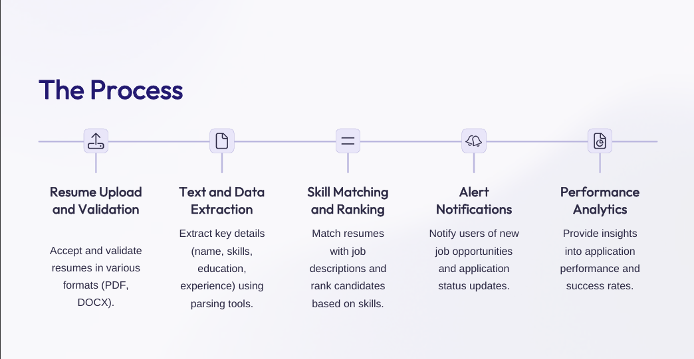
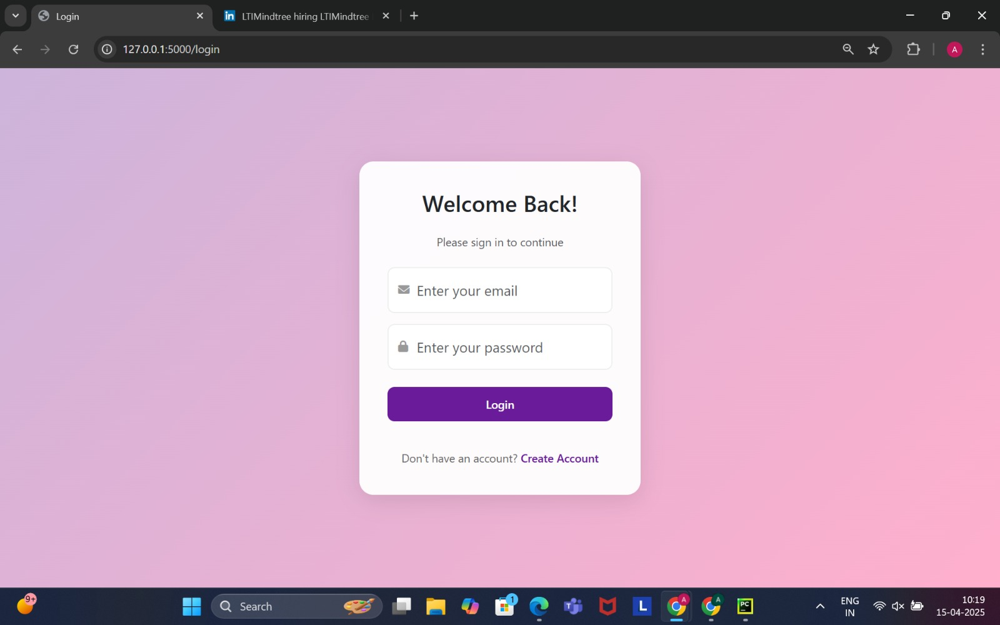
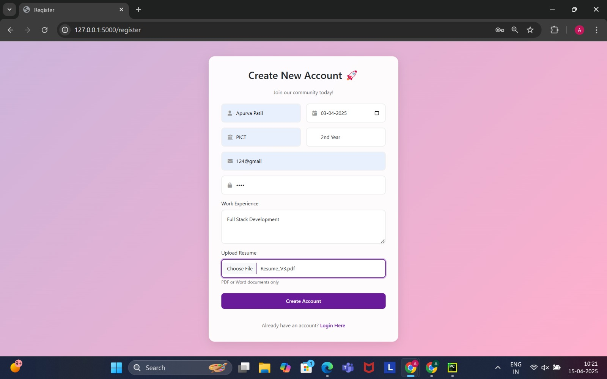
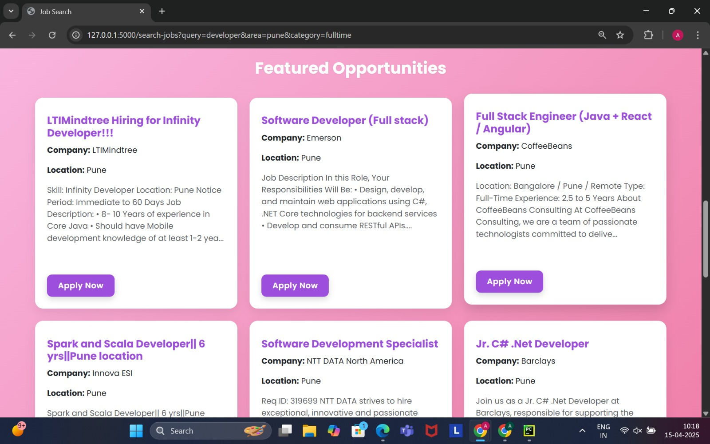

# 🧠 Automated Resume Application System (ARAS) – JobSeeker

A full-stack intelligent job tracker where users upload their resumes and receive real-time job recommendations based on their skills. It integrates with RapidAPI’s JSearch to fetch live job data.

---

## 🌟 Features

- Resume upload (PDF/DOCX)
- Python-based skill extraction using spaCy
- Auto-matching of parsed skills to live jobs via JSearch API
- User registration, login, session management
- Search jobs by title + location
- Dashboard shows recommended jobs using real skills

---
### Process

---

## 🖼 Output Screenshots

### 🏠 Landing Page

### 🔐 Login Page

### 📝 Register Page

### 📊 Dashboard

### 🔍 Job Search Page

### Apply link 

---

## 🛠 Tech Stack

| Layer        | Technology         |
|--------------|--------------------|
| Frontend     | HTML, CSS, JS, EJS |
| Backend      | Node.js, Express   |
| Resume Parser| Python, spaCy, PyPDF2 |
| Job API      | JSearch (via RapidAPI) |
| Database     | MySQL              |
| Auth         | bcrypt + express-session |

---

## 🚀 How to Run Locally

### 1. Clone and Install Dependencies
###bash
cd jobseeker-aras
npm install

### 2. Python Setup (Required for resume parsing)
pip install spacy PyPDF2
python -m spacy download en_core_web_sm

### 3. Fill the .env File
PORT=5000
DB_HOST=localhost
DB_USER=root
DB_PASS=
DB_NAME=jobseeker
RAPIDAPI_KEY=your_rapidapi_key_here

###5. Start the Server
mysql -u root -p < jobseeker.sql
npm install axios
npm start

###
Then open: http://localhost:5000

